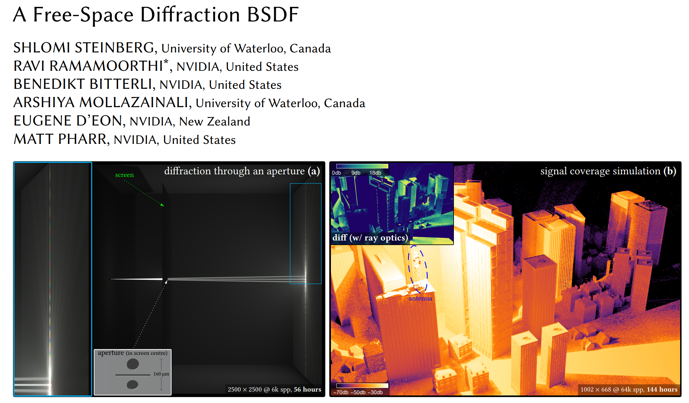

## Intro

Prof. Shlomi Steinberg published his first work on this ray-based wave optics topic about the time when I first met computer graphics. Now it has been about 5 years and he is definitely an expert in this domain. I would love to read his most recent published paper, *A Free-Space Diffraction BSDF*, as a preparation for my coming PhD student life.

Unlike most computer graphics papers, it's easier to begin with the code implementation rather than the theoretic derivation in the paper (and of course the very extensive supplementary materials) when reading the work of Prof. Shlomi. Luckily, I am familiar with his implementation platform, Mitsuba 0.6, where I can look at the 735 lines of C++ code (1001 lines including a header), rather than the 40 pages of theory, which is cumbersome to begin with even for a student who had adequate physics training (I did have good grades in optics, classis/quantum mechanics and eletrodynamics). Finally, we will get back to the theory, since that is the essence of this work.

## 

``` C++
class FreeSpaceDiffractionBSDF : public BSDF
{
public:
    static constexpr auto fsdLobe;
    static constexpr auto fsdMeasure;

    FreeSpaceDiffractionBSDF(const Properties &props);
    FreeSpaceDiffractionBSDF(Stream *stream, InstanceManager *manager);

    void addChild(const std::string &name, ConfigurableObject *child);
    inline auto fsdComponent() const;
    Spectrum eval(const BSDFSamplingRecord &bRec, EMeasure measure) const;
    Float pdf(const BSDFSamplingRecord &bRec, EMeasure measure) const;
    Spectrum sample(BSDFSamplingRecord &bRec, Float &pdf, const Point2 &sample) const;
    Spectrum sample(BSDFSamplingRecord &bRec, const Point2 &sample) const;
    Point3 evalInteractionPoint(const BSDFSamplingRecord &bRec, EMeasure measure) const;
    bool updatesInteractionPoint(const BSDFSamplingRecord &bRec, EMeasure measure) const;
    bool updatesInteractionPoint() const;
    Vector3 FSDwi(const BSDFSamplingRecord &bRec) const;
    Vector3 FSDwo(const BSDFSamplingRecord &bRec) const;
    bool FSDpossible(const BSDFSamplingRecord &bRec) const;

    using c_t = std::complex<Float>;

private:
    struct fsdBsdf {
        //    ...
    };
};
```

Where the fsdBrdf is nested in the main brdf:

```C++
struct fsdBsdf
{
private:
    struct edge_t
    {
        Vector2 e;  // Edge vector
        Point2 v;   // Mid point
        c_t a, b;   // Beam amplitude at vertices
        Float Phat; // Edge-diffracted power
        Float PhatAccum;
    };
    // Alpha functions and Psi
    static inline Float alpha1(Float x, Float y);
    static inline Float alpha2(Float x, Float y);
    static inline Float chi(Float r2);
    static inline c_t Psihat(c_t a, c_t b, Vector2 e, Point2 v, Float k, Vector2 xi);
    static inline Float Psihat2(c_t a, c_t b, Vector2 e, Float k, Vector2 xi);

    // Powers
    static inline Float Pt(Point2 u1, Point2 u2, Point2 u3, Float ph1, Float ph2, Float ph3);
    static inline Float Pj(c_t a, c_t b, Vector2 e);
    static inline Float Pjhat(c_t a, c_t b, Vector2 e);
    static inline Float Psi0t(Point2 u1, Point2 u2, Point2 u3, Float ph1, Float ph2, Float ph3);
    static inline Vector3 Sigmat(Point2 u1, Point2 u2, Point2 u3, Float ph1, Float ph2, Float ph3);

    inline Float eval(const Vector2 &xi) const;
    inline Float evalPdf(const Vector2 &xi) const;

public:
    const Float get_search_radius() const;

    fsdBsdf(const Scene *scene, const Point &p, const Vector3 &wi, const Frame &frame, const Float k, const Float beam_sigma);

    Float importanceSample(Vector3 &wo, Float &pdf, const bool SIR, Sampler *sampler) const;
    Vector3 findExitPoint(Sampler *sampler) const;
    Float P() const;
    Float pdf(const Vector3 &wi, const Vector3 &wo) const;
    Float bsdf(const Vector3 &wo) const;

    static fsdPrecomputedTables tables;

private:
    Vector2 sampleEdge(const edge_t &e, Float &pdf, Sampler *sampler) const;
    Vector3 findExitPoint(const decltype(fsdBsdf::edges)::const_iterator &eit, Sampler *sampler) const;

    Frame frame;
    Float Ppl_A = .0f;
    Float sumPhat_j;
    Float Ppl_0;
    Float k;
    Float beam_sigma;
    std::vector<edge_t> edges;

private:
    using cache_key = std::pair<Point3, Vector3>;
    struct cmp
    {
        bool operator()(const cache_key &a, const cache_key &b) const;
    };

    static thread_local std::map<cache_key, fsdBsdf, cmp> cache;
    const fsdBsdf constructFSDBSDF(Frame frame, Point3 p, Vector3 wi, const Scene *scene, int &spec_idx) const;

public:
    Float getRoughness(const Intersection &its, int component) const;

private:
    bool m_enabled, m_SIR;
    ref<BSDF> m_bsdf;
    float m_sigma, m_scale;
};
```

## Why it requires so many samples?

---

## Disclaimer

- The figures comes from the paper or Internet.
- The comments are quite subjective, and I welcome all kinds of discussion.