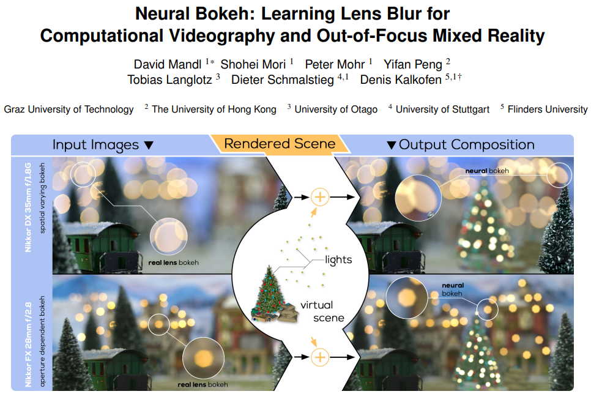
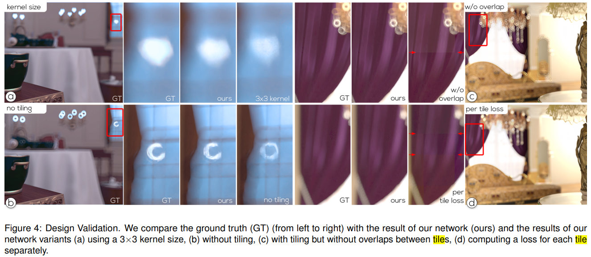
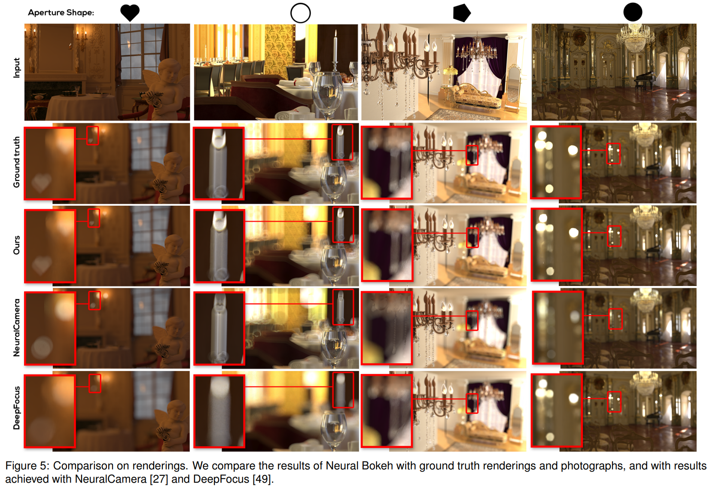

Project page: https://immersive-technology-lab.github.io/projects/neuralbokeh/

## Bokeh

    

Bokeh, a term derived from the Japanese word "boke," refers to the aesthetic quality of the blur in the out-of-focus areas of an image, created by the circles of confusion. It's often described as "the way the lens renders out-of-focus points of light." The appearance of bokeh can vary significantly due to differences in lens aberrations and aperture shape. Some lenses produce a pleasing blur, enhancing the image, while others create distracting or unpleasant blurring, known as "good" and "bad" bokeh, respectively. Photographers sometimes intentionally use a shallow focus technique to emphasize bokeh and create images with distinct out-of-focus regions.

In Mixed Reality (MR) image and video compositing, synthesizing convincing out-of-focus effect is of great importance. In this paper, the authors propose Neural Bokeh, a deep learning approach to automatically generate a coherent defocus blur in MR renderings.

## Circle of Confusion

$$
    c=\frac{w_i}{w_s} \cdot a \cdot d_s \frac{\left|d_p-d_f\right|}{d_p \cdot d_f}
$$
where $w_i$ is the image width in pixels, $w_s$ is the sensor width in $\mathrm{mm}$, $a$ is the aperture diameter, $d_s$ is the distance between the lens and sensor, $d_p$ is the distance to the point $p$, and $d_f$ is the distance to the object plane of the lens.

The incoming light gets scattered within this circle. When an out-of-focus small bright luminator gets projected to the film, it presents the Bokeh effect.

During rendering, we can take the perspective of a pixel sensor, which gathers light from other pixels (that were supposedly perfectly luminated w/o any out-of-focus effect). Different aperture shapes lead to different bokeh shapes.

## Method

> To efficiently learn the appearance, we reduce the number of input parameters and thus fix the aperture size, the width of the camera sensor, and the width of the image size, leading to different networks for different values of $a, w_i$, and $w_s$.

So each camera (both virtual and real-world) has its own network.

> From a combination of those parameters, we compute the maximal size of the CoC, which serves as a hyper-parameter for adjusting the number of convolutions in the network.

    

CoC map is not explicitly defined in the paper. Here I assume it is a number corresponding to each pixels calculated directly from the depth image. (However, how is the focal stack required in the CoC extraction?)

The network learns to simulate a specific bokeh by processing pairs of an all-in-focus (AIF) image and a circle-of-confusion (CoC) map into a defocused output image.

They seperate the image into tiles,
> because lens vignetting commonly results in a varying blur across the field of view of the camera.

The paper uses both synthetic and captured data. 

For synthetic data, they render images using the path-tracing capabilities of VRay 6 for 3ds Max. In total, we render images from 15 viewpoints at random locations in 15 virtual environments to ensure a broad coverage of scene types. For each viewpoint, we render 10 differently focused images at a size of 1920×1080 pixels, resulting in 2250 images per evaluation dataset.

For captured data, they use about the similar size of a dataset, while the depth needs to be extracted from multiview reconstruction methods.

## Results

This paper shows good results on the bokeh, since it has the information of the camera model embedded in the virtual object adding neural network.

## Comments
- The idea is overall cool. Using NN to synthetic out-of-focus effect (especially on real-world captured data) is useful. 

- The philosophy is pragamatic. We don't need to fully reconstruct the lens model, including the aperture, lens set and the sensor to add virtual objects to the final image. Just use a neural network to composite the final image.

---

## Disclaimer

- The figures comes from the paper or Internet.
- The comments are quite subjective, and I welcome all kinds of discussion.