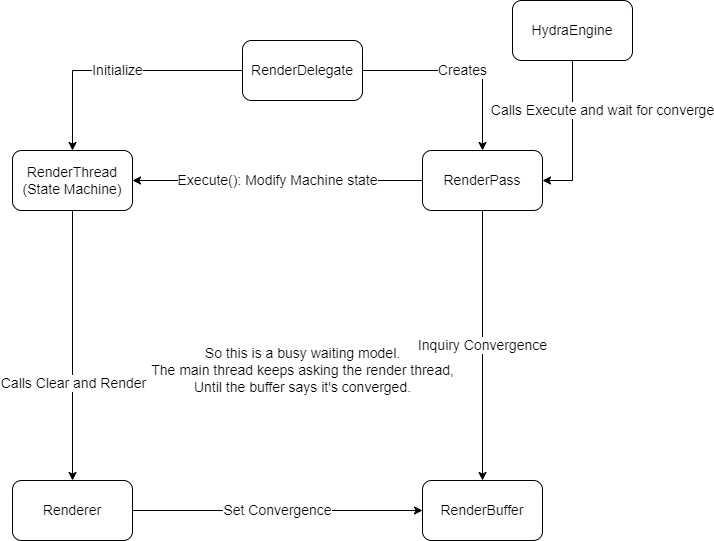

## Hd : The Hydra Framework

Hydra is a framework that enables the communication between multiple scene graphs and multiple renderers.

[https://openusd.org/release/api/hd_page_front.html](https://openusd.org/release/api/hd_page_front.html)

## Basic call graph

Hydra provides interfaces as RenderDelegates.

This is the description of the official hdEmbree example.

The render buffer class holds the information of convergence and the RenderPass on the main thread keeps asking whether it has converged, while there is a seperate renderthread doing the hardwork.