# Introduction
Being the TA for the CG course at USTC 2024 Spring, I collabrating with two other TAs built this framework. The idea/code is partially based on Blender. More details will come later.

# Students' Works
Here are some of the students' works finished using this framework during this whole semester.
## Geometrical Processing
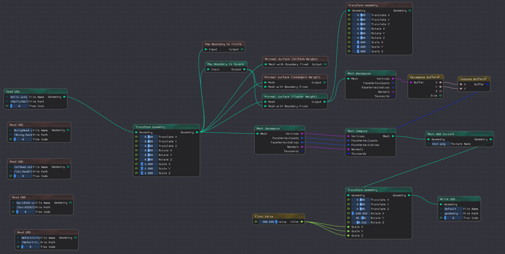
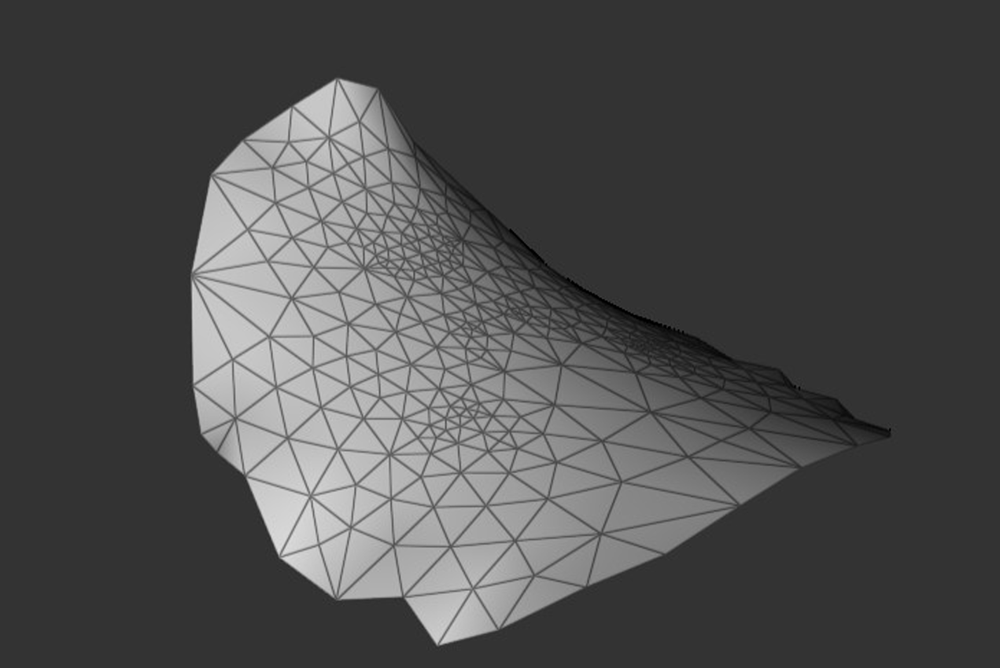
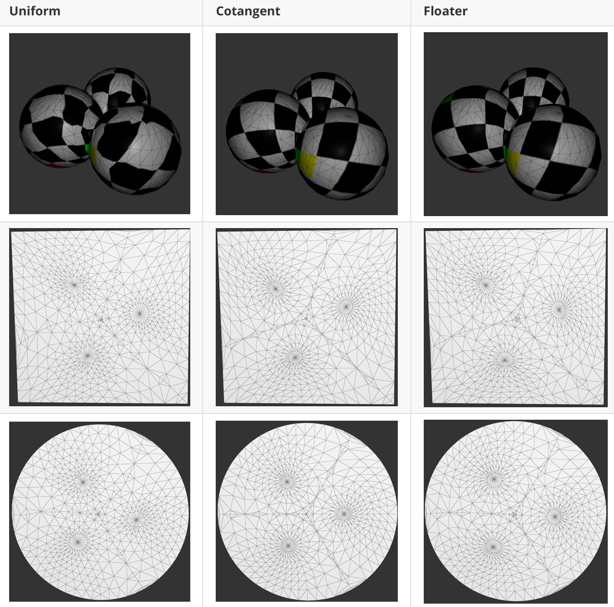
ARAP
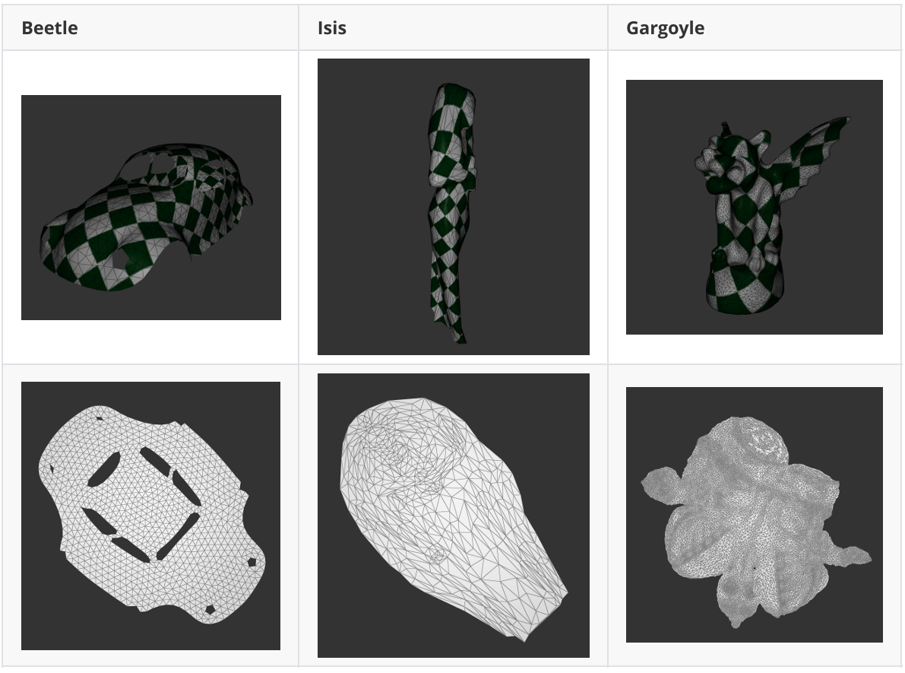

## Rendering

### OpenGL

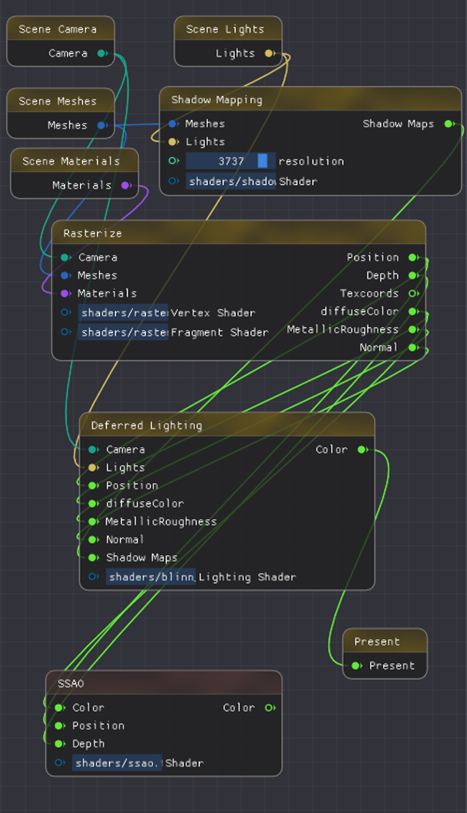
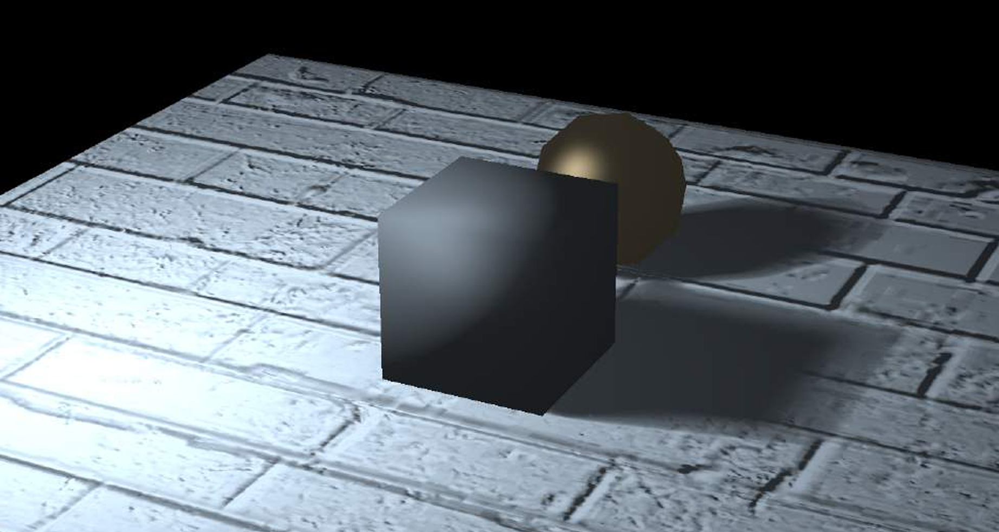
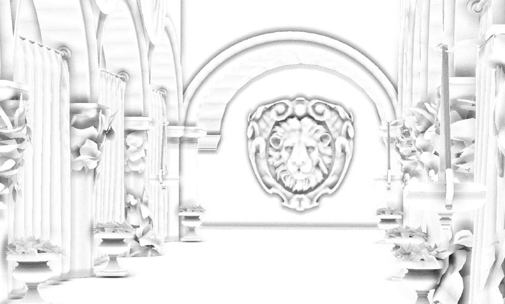
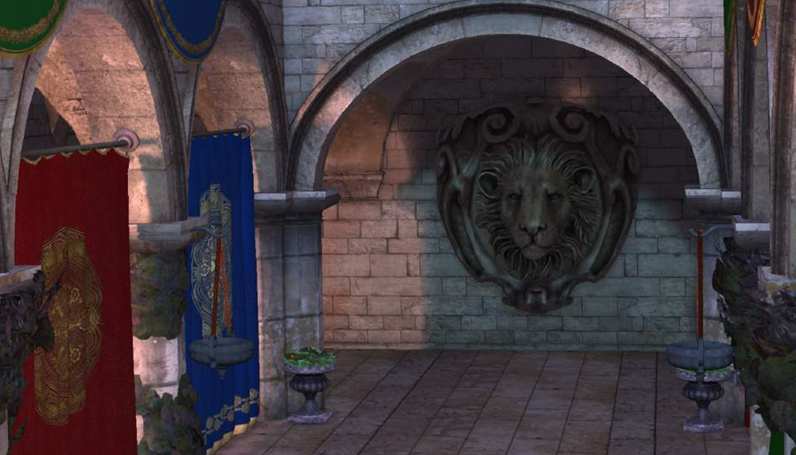

### Path Tracing

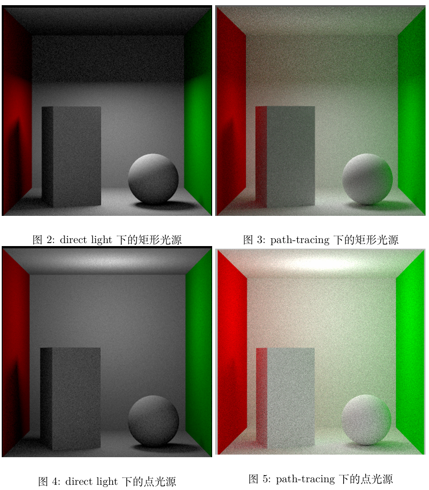
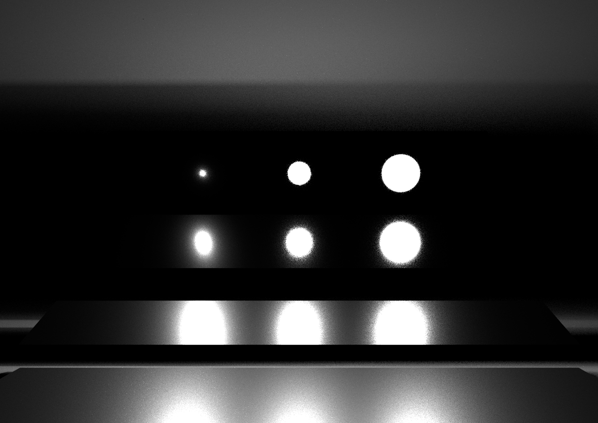
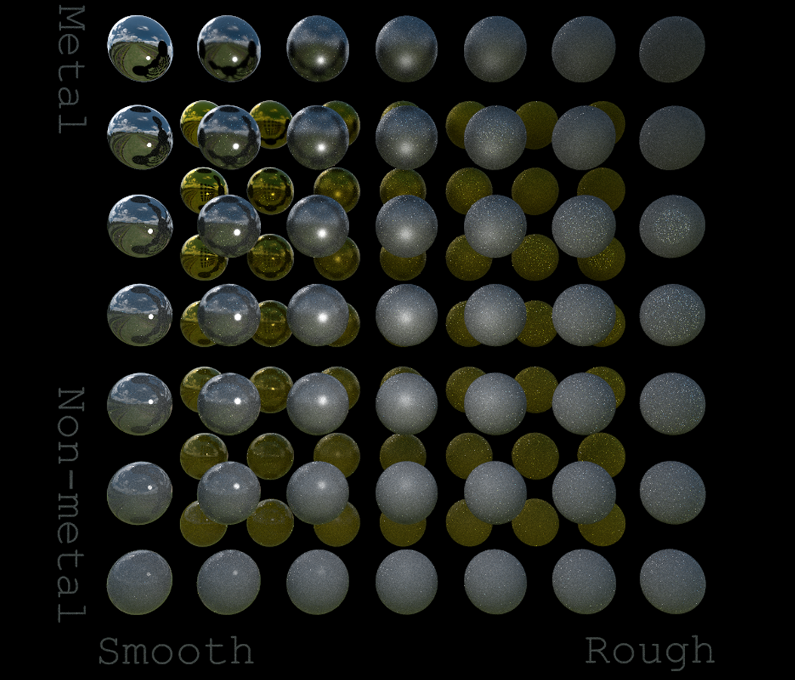

## Simulation

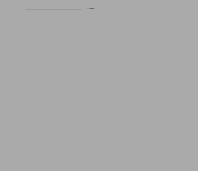
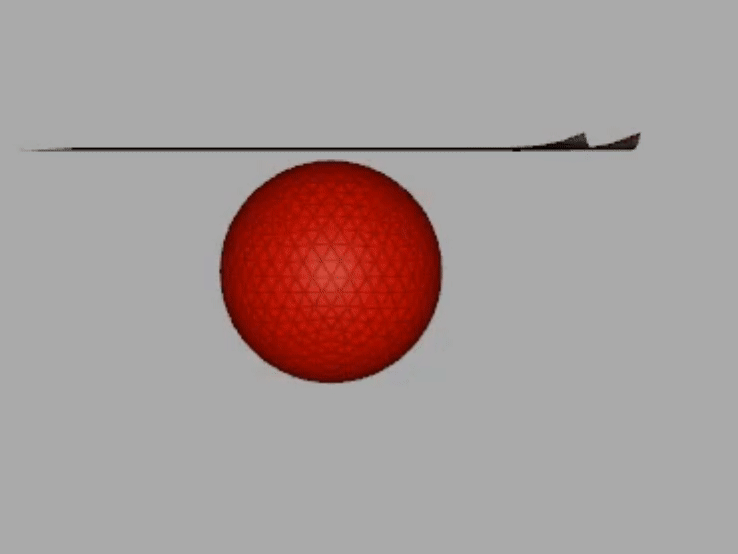

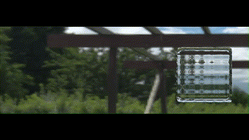

## Animation

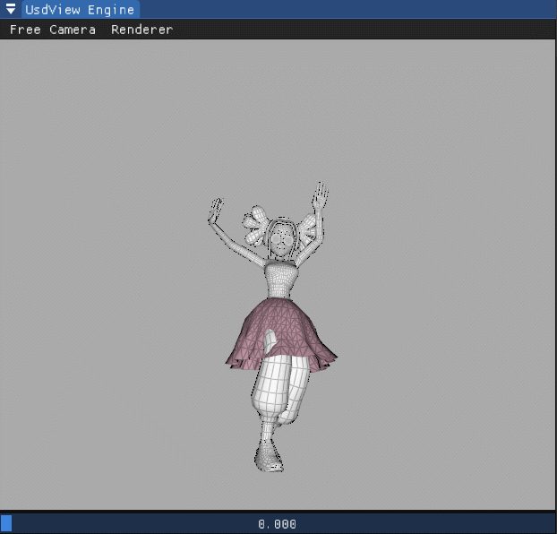
