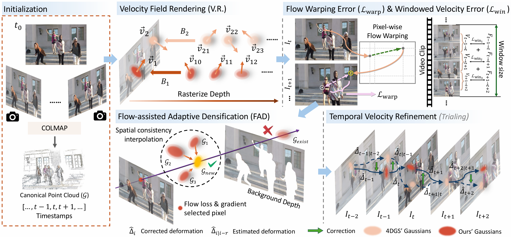
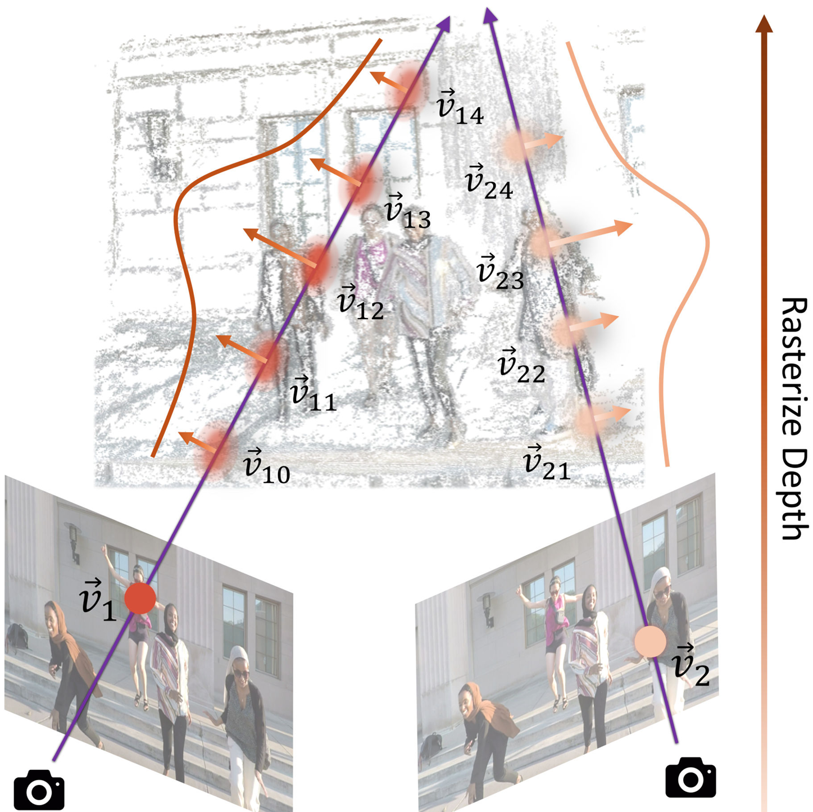
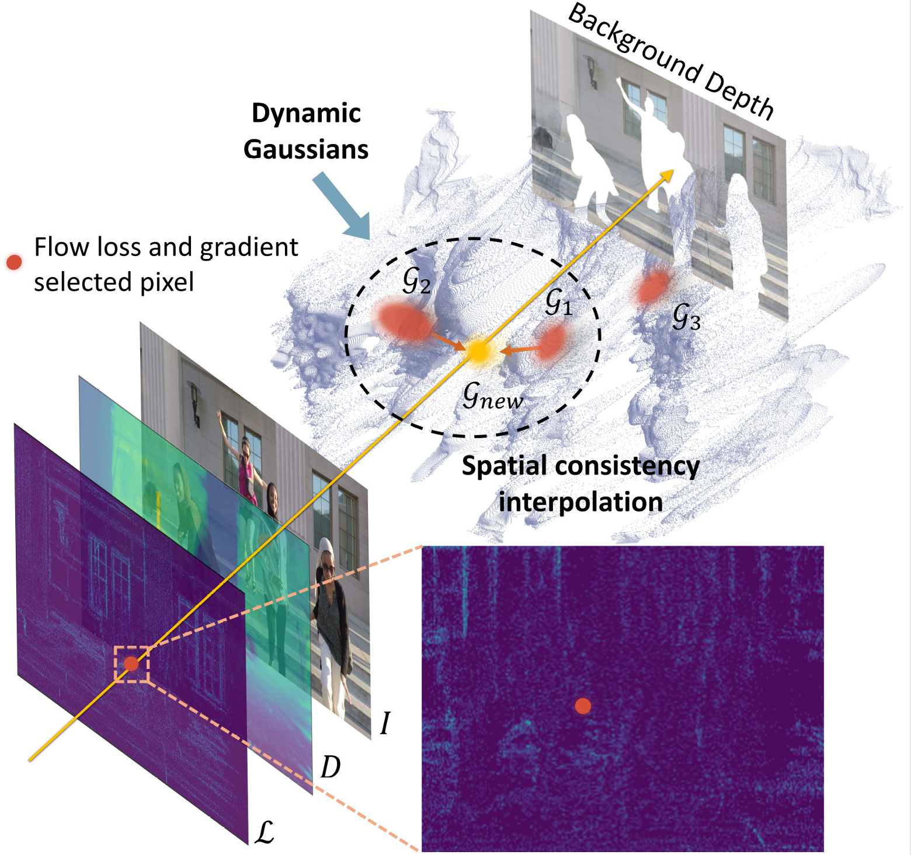
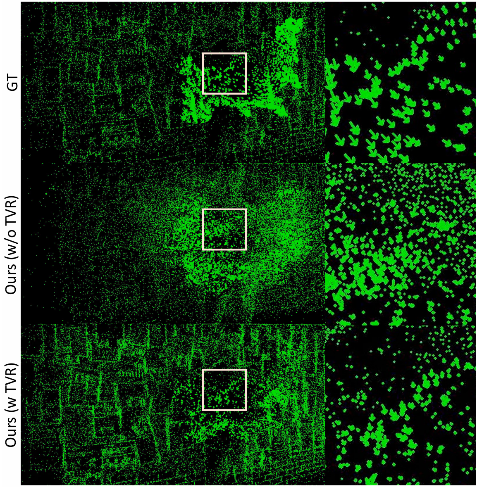
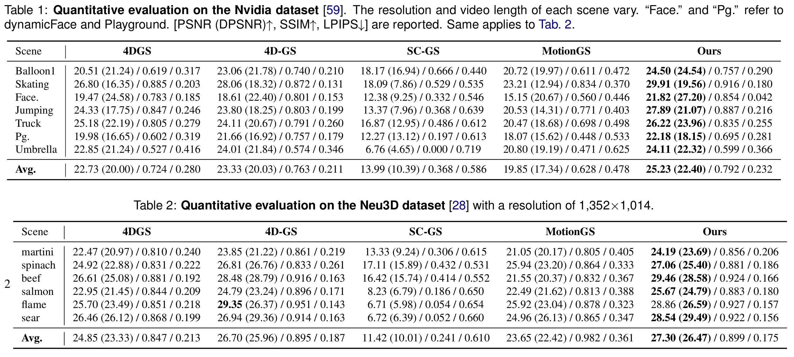
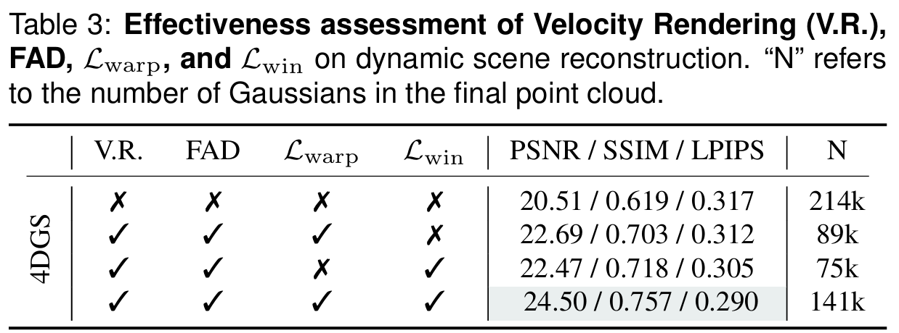
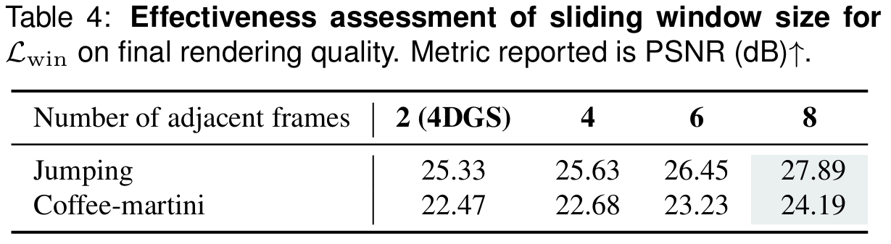
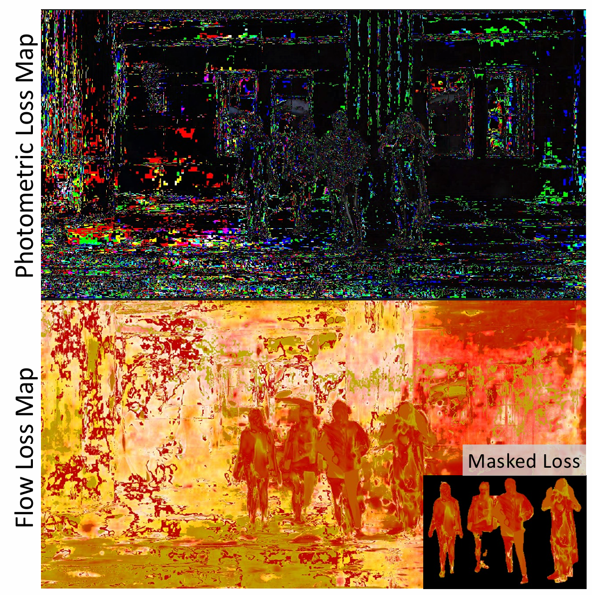

## Introduction

3D scene reconstruction is essential for immersive AR/VR applications, ranging from virtual modeling to autonomous driving and medical surgery. While 3D Gaussian Splatting (3DGS) has shown remarkable progress in reconstruction quality and rendering efficiency, dynamic scene reconstruction remains challenging.

*[Figure 1: Pipeline Overview - velocity field modeling with optical flow constraints and FAD strategy]*
<!-- LaTeX: \label{fig:pipeline}, figures/pipeline-v1.pdf -->

Existing dynamic Gaussian Splatting methods follow two main approaches: deformation-based methods that learn deformation fields, and trajectory-based methods that explicitly model geometry transformations. However, Gaussian trajectories predicted by deformation networks often lack consistency and fail to align with actual object motion, resulting in suboptimal reconstruction quality.

We propose **FlowGaussian-VR**, which incorporates optical flow supervision into velocity field modeling for 3D Gaussian dynamics. Our approach renders 2D velocity fields through differentiable rasterization and optimizes them using optical flow guidance from models like RAFT.

## Method

### Velocity Field Rendering

Building on 4D Gaussian Splatting (4DGS), we assign velocity attributes to each Gaussian to capture motion dynamics. Each Gaussian is defined as $G_i = (\mathbf{\mu}_i, \Sigma_i, c_i, \sigma_i, v_i)$, where $v_i$ represents the 2D velocity vector.

We render velocity fields using alpha-blending analogous to color rendering:
$$V(\mathbf{p}) = \sum_{i=1}^{N} \alpha_i \, v_i \, \prod_{j=1}^i (1 - \alpha_j)$$

This rendered velocity field serves as a differentiable approximation of optical flow, enabling direct supervision of Gaussian motion through backpropagation.

*[Figure 2: Velocity Rendering Process - alpha-blending of Gaussian velocities]*
<!-- LaTeX: \label{fig:velocity rendering}, figures/VR.pdf -->

### Flow-based Constraints

To align rendered velocity with actual scene dynamics, we introduce three complementary loss functions:

**Windowed Velocity Error ($\mathcal{L}_{\mathrm{win}}$)**: Employs a temporal sliding window of $\tau+1$ frames to ensure multi-frame consistency. This loss directly compares rendered velocity fields with ground truth optical flow:
$$\mathcal{L}_{\mathrm{win}} = \| \hat{\mathbf{V}}_i(\tau) - \widetilde{\mathbf{V}}_i(\tau) \|_1$$

**Flow Warping Error ($\mathcal{L}_{\mathrm{warp}}$)**: Validates temporal correspondence by warping the next frame using rendered velocity and comparing with current frame:
$$\mathcal{L}_{\mathrm{warp}} = \| W_{{t+\delta t \rightarrow t}}(\hat{\mathbf{I}}_{t+\delta t}, \hat{\mathbf{V}}_{t+\delta t \rightarrow t}) - \tilde{\mathbf{I}}_t \|_1$$

**Dynamic Rendering Loss ($\mathcal{L}_{\mathrm{dyn}}$)**: Focuses optimization on moving objects using SAM-2 segmentation masks:
$$\mathcal{L}_{\mathrm{dyn}} = \| \hat{\mathbf{I}} \odot \mathbf{M}_{\text{dyn}}, \, \tilde{\mathbf{I}} \odot \mathbf{M}_{\text{dyn}} \|_1$$

These losses work synergistically to constrain Gaussian motion while preserving photometric accuracy.

### Flow-assisted Adaptive Densification (FAD)

*[Figure 3: FAD Strategy - shows flow-guided Gaussian densification process]*
<!-- LaTeX: \label{fig:fad}, figures/fad.pdf -->

Traditional densification relies on photometric gradients, which inadequately capture dynamic content. Our FAD strategy addresses this by using flow-based losses to identify and densify challenging dynamic regions.

The process involves four key steps:

1. **Flow-assisted Pixel Selection**: Identify pixels where $\mathcal{L}_{\mathrm{win}}$ and its gradients exceed threshold $\epsilon$, filtered by dynamic segmentation masks to exclude background regions.

2. **Lifting to 3D Space**: Convert selected 2D pixels to world coordinates using rendered depth $\mathbf{Z}$ and camera parameters:
   $$\mathcal{P}' = \mathbf{K}^{-1} [\mathbf{R}, \mathbf{T}]^{-1} \cdot (x, y, 1)^T \cdot Z$$

3. **Farthest Point Sampling**: Apply FPS with ratio $r$ to ensure spatial distribution of new Gaussians.

4. **Attribute Interpolation**: Use kNN to interpolate Gaussian attributes from existing neighbors, then map back to canonical space via inverse deformation.

### Temporal Velocity Refinement (TVR)

Deformation networks don't ensure physically consistent motion. We propose **TVR** using Extended Kalman Filter (EKF) as post-processing to smooth Gaussian trajectories.

EKF refines Gaussian motion by defining state transition $\mathbf{f}(\mathbf{x}_{t-1}) = D(D^{-1}(\mathbf{x}_{t-1}, t-1), t)$ and observation function $\mathbf{h}(\mathbf{x}) = \mathrm{VRaster}(\mathbf{x})$. It iterates between forecast (predict using deformation) and assimilation (correct using optical flow) steps.

Key strategies include surface Gaussian filtering and accumulated flow localization to prevent error propagation.

*[Figure 4: TVR Trajectory Correction - shows smoothed vs original Gaussian motion]*
<!-- LaTeX: \label{fig:ekf viz}, figures/ekf-viz.pdf -->

## Experiments

### Experimental Setup

We evaluate on two challenging datasets:
- **Nvidia-long**: 7 scenes with 90-210 frames, 12 camera views per frame
- **Neu3D**: 6 scenes with 300 frames each, 15-20 static cameras

We report standard metrics (PSNR, SSIM, LPIPS) and Dynamic PSNR (DPSNR) specifically for moving regions. Ground truth optical flow is obtained using RAFT, and dynamic masks are generated using SAM-2.

*[Table 1: Quantitative Results on Nvidia Dataset]*
<!-- LaTeX: \label{tab:nvidia-all-scene-1} -->
*[Table 2: Quantitative Results on Neu3D Dataset]*
<!-- LaTeX: \label{tab:neu3d-all-scene-1} -->

### Results and Analysis

Our method achieves significant improvements over state-of-the-art baselines:
- **Overall Performance**: 2.5 dB (Nvidia-long) and 2.45 dB (Neu3D) PSNR improvement
- **Dynamic Regions**: 2.4 dB and 3.14 dB DPSNR improvement respectively
- **Comparison with Methods**: Outperforms 4DGS, 4D-GS, SC-GS, and MotionGS across all scenes

*[Figure 5: Novel View Synthesis Results - "Truck" scene with velocity field visualization]*
<!-- LaTeX: \label{fig:sota nvidia-long}, figures/nvidia-sota.pdf -->

*[Figure 6: Qualitative Comparisons - multiple scenes showing improved dynamic reconstruction]*
<!-- LaTeX: \label{app fig:sota nvidia}, figures/new_fig8_nvidia.png -->
<!-- LaTeX: \label{app fig:sota neu3d}, figures/fig8.PNG -->

The velocity field visualizations demonstrate that our method produces physically plausible Gaussian motion, with gradually enlarging Gaussians matching actual object dynamics, while baselines show inconsistent trajectories.

### Ablation Study

*[Table 3: Component Analysis - effectiveness of velocity rendering, FAD, and flow losses]*
<!-- LaTeX: \label{tab:abl-1} -->

*[Table 4: Window Size Impact - sliding window parameter study]*
<!-- LaTeX: \label{tab:abl num adj} -->

Key findings confirm the contribution of each component:
- Velocity field rendering enables direct motion supervision  
- FAD effectively densifies dynamic regions using flow guidance
- Multi-frame temporal windows (τ=8) provide optimal consistency
- Flow-based losses focus optimization on dynamic content vs. photometric losses

*[Figure 7: Loss Visualization - flow vs photometric loss distribution]*
<!-- LaTeX: \label{fig:compare gradient}, figures/fig6.pdf -->

## Conclusion

We present FlowGaussian-VR, an enhanced velocity field modeling technique for Gaussian video reconstruction. By rendering velocity fields and incorporating flow-based constraints, our method achieves more accurate and temporally consistent dynamic scene reconstruction. The FAD strategy effectively handles challenging dynamic regions, leading to significant improvements in visual quality and motion accuracy.

**Limitations**: The method faces challenges with rapid motion and abrupt object changes. Future work could explore better dynamic Gaussian control and optimization strategies for complex scenarios.
