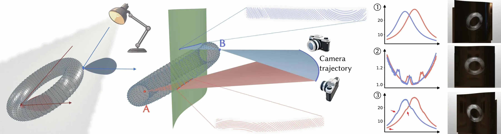

## Introduction

Research on computational 3D visual artworks in the graphics community explores the creation and manipulation of optical illusions that leverage 3D effects to engage and deceive the viewer's perception. Representative artworks in this domain include scratch or abrasion holograms, which exhibit compelling visual effects by representing virtual geometry using scratches. The fundamental principle of scratch holography involves the interaction between a moving camera view and varying light paths, resulting in dynamic highlights that shift correspondingly. When the motion of a highlight aligns with the movement of a sampled point on a virtual object within the view, it effectively serves as a substitute for that virtual point.

However, previous works have not extensively studied the luminance of highlights—most assume that as long as the highlight moves correctly, its luminance remains unaltered. This distinction is noteworthy in practice, as by modulating the luminance of the scratch highlight, one can incorporate shading effects into the virtual space, enhancing the representation with greater detail. Additionally, most scratch design pipelines focus on planar surfaces, overlooking how surface curvatures impact light reflection behavior.

This work addresses these challenges by proposing a framework to specify scratches that represent both highlight movement and luminance variations.

## Method Overview

<figure style="text-align: center;">
  
  <figcaption><strong>Figure 1:</strong> Overall pipeline of our scratch design.</figcaption>
</figure>

The figure illustrates the overall pipeline of our scratch design. Given a desired virtual object with a specified shading effect, alongside a base surface together with a fixed lighting condition and a pre-determined camera trajectory, our approach first derives the necessary scratch density and orientation based on the radiance requirements.
Then, the corresponding scratch curves are generated by numerically solving the associated ordinary differential equation (ODE). These optimized scratch curves are eventually manufactured using an off-the-shelf carving machine to create the real artwork, delivering the desired view-dependent imagery.

## Video

